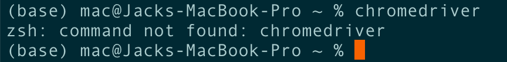
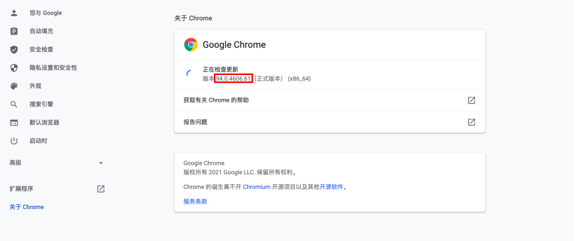
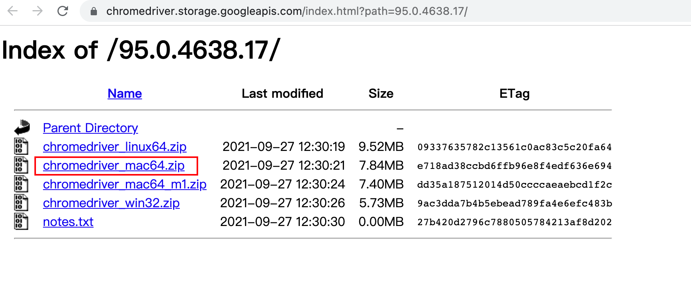
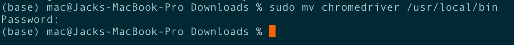
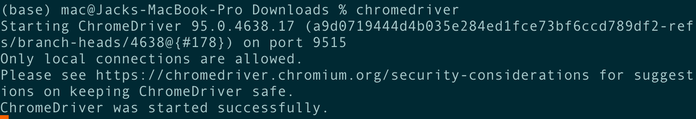

# ZJU_PunchClock

* [ZJU_PunchClock](#zju_punchclock)
   * [Steps to use](#steps-to-use)
      * [Clone the repository](#clone-the-repository)
      * [Install the dependencies on your python](#install-the-dependencies-on-your-python)
      * [Config your identical information](#config-your-identical-information)
      * [Install the chromedriver](#install-the-chromedriver)
      * [Run the program](#run-the-program)

Before you started, you need to guarantee that you’ve already installed `python3` and `pip3`.

## Steps to use

### Clone the repository

```shell
git clone https://github.com/BiEchi/ZJU_PunchClock
```

### Install the dependencies on your python

```shell
pip3 install selenium
pip3 install time
pip3 install configparser
```

### Config your identical information

You need to create a file in the root directory of this repository called `config.ini` with your personal information in it.

```shell
touch config.ini
```

Then please go into the file and edit it to be in this form:

```shell
[identification_information]
account_config=Haob.88@intl.zju.edu.cn
password_config=FAKEDPASSWD
```

### Install the `chromedriver`

**Install the Chrome driver**

You also need to install `chromedriver` into your system `PATH`.

**Before started**

Before you install the chromedriver, you should have:



Then you need to install the `chromedriver`. 

**Check for the right version of Chrome**

Please open the current Chrome (if you have) and check which version you're in. For example, mine is 94.0.4606.



 **Download the correct version of chromedriver**

Go to [the download website](https://chromedriver.chromium.org/) to download the correct version of ChromeDriver. If you're using Windows, make sure you download the Windows version. I'm using Mac, so I'll download the Mac version.

After downloading, please unzip the file and move it to your system PATH.



Then please check whether you've successfully installed your chromedriver. If you see the feedback below, you're all set.



Notes:

\-   You must download exactly the same version of `chromedriver` as your chrome browser if you want to use the `chromedriver` as your selenium driver. The chrome browser on your machine is likely to be updated automatically when a new version is released. In this case, please update to the newest version of `chromedriver` too.

\-   I strongly recommend you to install the `chromedriver` into the system software directory immediately, i.e. it should appear in `/usr/local/bin/chromedriver`.

### Run the program

At last, just run the `main.py` program.

```shell
python3 main.py
```

